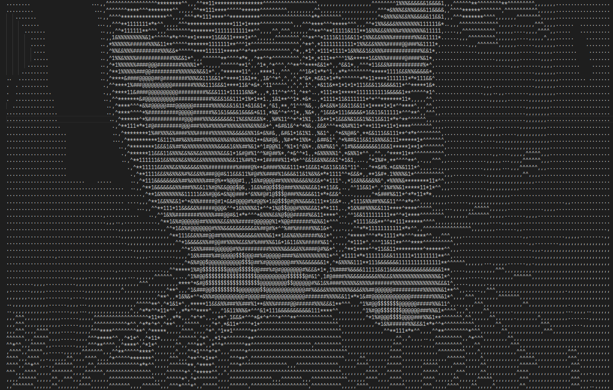

# img_to_ascii

A simple image to ascii converter.

The script takes an input image and converts it to a string. Simulating the light intensity with different ascii characters.

The algorithm is the following:
1. Divide the image into chunks (--numChunks). Due to character height being ~2x greater than width we have twice as many chunks in the X direction than in the Y direction (for image with aspect ratio 1:1)
2. Calculate the average light intensity in each chunk
3. Map the chunk intensity to a character (`.` dark `$`)

So 1 chunk -> 1 character

Functionalities:
- convert input image to ascii text image (--fileName)
- convert live camera output to ascii file (--live) - you can lookup the result with VSCode auto-refresh functionality
- specify chunk amount

## Setup

```
python -m pip install opencv-python
python -m pip install pillow
```

# Examples

## Live
```
python main.py --live --numChunks 200  
```
You can see the camera image by using a text editor that supports automatic reload. 

For example try Visual Studio Code.

Just launch the script and open the file.

## Cat
```
python main.py --file cat.jpeg --numChunks 200  
```

(Source https://commons.wikimedia.org/wiki/File:Adorable-animal-cat-20787.jpg)




# Todo

- Add the possibility of adding custom intensity mapping characters